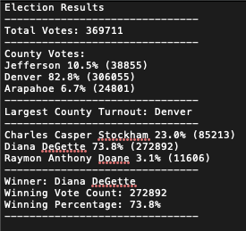

# Election_Analysis

## Overview of Election Audit
The purpose of this election audit analysis was to help a Board of Elections employee Tom in an election for a Congressional precinct in Colorado. The analyst and Tom were put in charge of reporting the total number of votes cast, the total number of votes for each candidate, the percentage of votes for each candidate, the total number of votes per county, the percentage of votes per county, the county with the highest turnout, and the winner of the election. Tom's manager wants to know if there is a way to automate this using python with hopes to audit not only other congressional districts but also senatorial districts and local elections. Below are the results of the audit for the Congressional precinct in Colorado.

## Election - Audit Results 

The audit of the Congressional precinct in Colorado shows that there was a total of 369,711 votes cast. There was a total of 3 counties that were audited for this election, which was the county of Jefferson, Denver, and Arapahoe. Jefferson County had a total of 38,855 votes cast (10.5% of total votes), Denver County had a total of 306,055 (82.8% of total votes), and Arapahoe had 24,801 votes cast (6.7% of total votes). The county with the highest turnout was Denver with an 82.8% of total votes cast. Also, the three candidates that were up for election were Charles Casper Stockham, Diana DeGette, and Raymon Anthony Doane. Charles Casper Tockham received a total of 85,213 votes cast (23.0% of total votes), Diana DeGette received a total of 272,892 votes cast (73.8% of total votes), and Raymon Anthony Doane received a total of 11,606 votes cast (3.1% of total votes). The winner of the election was Diana DeGette with an impressive winning percentage of 73.8%. If the other two candidates combined their votes they would still not be able to compete with Diana DeGette, she swept the other two candidates.

## Election - Audit Summary

### Proposal
Currently, this python script was designed with parameters ballot id, county, and candidate in mind. Once the data changes by let's say adding other parameters such as first-time voter or voters age, the current python script fails to capture that data. The script would still compile and output the same results above but it would not do anything with the first time voter or voters age data. There is no such thing as one script fits all, scripts are built with a goal in mind which is to solve a specific problem. Scripts can be modified to fit multiple uses cases but it's difficult to tailor them to fit all use cases. If this python script wants to be used in other elections it's best to understand the overall purpose and then trim item from there. That way if the script is given more or fewer data the script can adapt to the data it's given and provide an output. To improve this script to fit the majority of elections two main questions need to be asked. First, what data is going to be fed to the python script is essential to solving the problem? Second, is the script designed to handle the different types of data that it will be fed? Analyzing the overall data that will be fed to the python script to make sure the script can handle the data that it will be fed is essential to providing a desirable output. Also, the architecture of the script has to be dynamic and adapt to the data that is fed. For example, let's say in the senatorial elections they are interested in capturing first-time voters turnout and voters age. However, in the congressional elections, they are only interested in the ballot id, county, and candidate. The script has to be dynamic to decide if the first time voter and voter age data is not included to not show the analyst and error but to notify them that, that data is missing while still providing an output. If these two questions are kept in mind in the design stages of the script there's no need to ever modify the script which not only saves the analyst time from future changes but also a better product is built.
